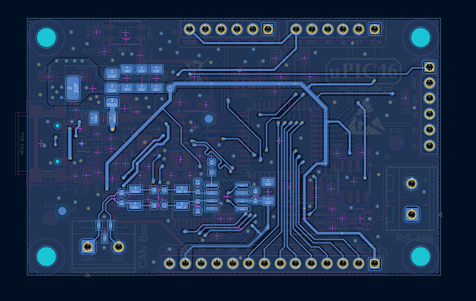

# uPIC46

uPIC46 Development Board

The uPIC46 is a development board designed around the Microchip PIC18F46K22-I/PT microcontroller.  
It is intended for hobbyists, students, and professionals who want a versatile platform for learning, prototyping, and industrial communication testing.

----------------------------------------------------
✨ Features
----------------------------------------------------
- MCU: PIC18F46K22-I/PT (TQFP package)
- Clocking: External crystal oscillator support
- Memory Expansion: Onboard 24LC256 I²C EEPROM
- RTC: DS3231MZ real-time clock
- USB-UART Bridge: For programming and PC communication
- Connectivity:
  * UART, SPI, I²C headers exposed
  * RTS/CTS and other flow-control pins available on headers
  * RS-485 transceiver for half-duplex communication
  * CAN Bus interface via MCP2515 + SN65HVD230
- Reset & Indicators:
  * Reset push button
  * User indicator LEDs
- Headers:
  * Clearly labeled header pins (A1, A2, A3…) with silkscreen reference table on PCB
  * Breakout headers for easy access to MCU I/O pins

----------------------------------------------------
🛠 Hardware Design
----------------------------------------------------
- Compact and user-friendly layout
- Industrial interfaces: CAN and RS-485 included
- Silkscreen pinout table on PCB for quick reference

----------------------------------------------------
📂 Repository Structure
----------------------------------------------------
uPIC46/
├── hardware/      → KiCad project files (schematic, PCB)
├── docs/          → Documentation, pinout tables, images
│   ├── pcb_spec/
│   └── images/
└── README

----------------------------------------------------
📸 Images
----------------------------------------------------

----------------------------------------------------
📜 License
----------------------------------------------------
This project is open-source. You are free to use, modify, and distribute it under the terms of the MIT License.
